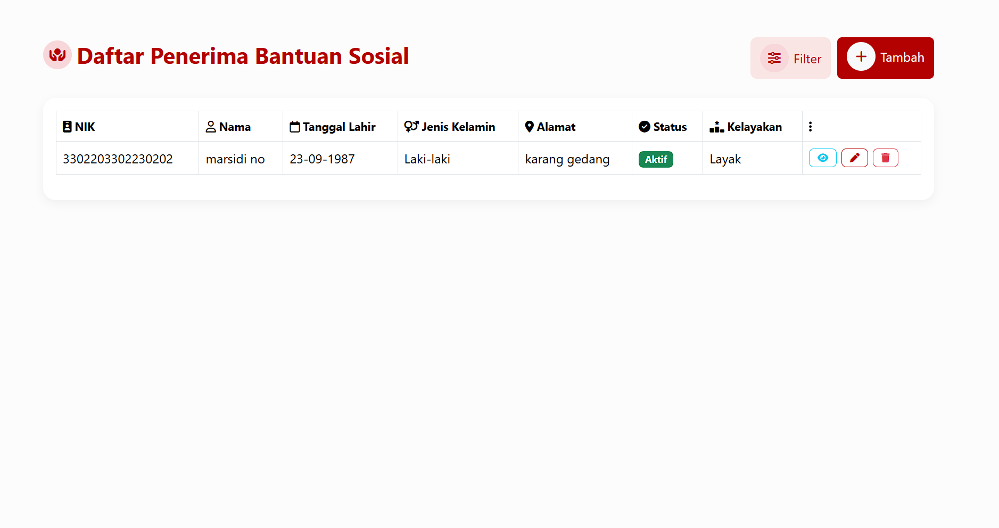

# 📦 Bantuan Sosial Fahrudin

**Aplikasi Web Pendataan & Penilaian Kelayakan Penerima Bantuan Sosial**  
Dibuat dengan Laravel 12, Bootstrap 5.3.3, dan Font Awesome 6.5  
🎓 Proyek Akademik oleh Fahrudin (STI202202909)

  

---

Aplikasi ini membantu mengelola data penerima bantuan sosial dengan sistem penilaian kelayakan otomatis. Pengguna dapat menambahkan data penerima, melakukan penilaian berdasarkan kriteria sosial ekonomi, serta memfilter dan mengelompokkan data secara dinamis dan interaktif.

---

## 🚀 Fitur Unggulan

- 🔁 **Manajemen Data Penerima**
  - Tambah, edit, lihat, dan hapus data dengan validasi otomatis
  - Validasi NIK unik (16 digit), tanggal lahir, dan informasi penting lainnya

- 🧠 **Penilaian Kelayakan Otomatis**
  - Berdasarkan pendapatan, jumlah tanggungan, dan kondisi rumah
  - Skor & kategori:
    - Pendapatan ≤1 juta (40 poin), 1–2 juta (20), >2 juta (0)
    - Tanggungan ≥5 (30), 3–4 (15), <3 (0)
    - Kondisi rumah: Tidak Layak (30), Kurang Layak (15), Layak (0)
    - Total skor menentukan kategori: `Sangat Layak`, `Layak`, `Kurang Layak`, `Tidak Layak`

- 🔎 **Filter & Pencarian Dinamis**
  - Filter berdasarkan skor, pendapatan, tanggungan, kondisi rumah
  - Pagination otomatis untuk data dalam jumlah besar

- 🎨 **Desain Modern & Responsif**
  - Warna utama merah `#b30000` dengan UI Bootstrap 5.3.3
  - UX ditingkatkan dengan gradien form & ikon input dari Font Awesome 6.5.0

- 🧹 **Cascade Delete**
  - Menghapus data penerima otomatis menghapus seluruh data penilaiannya

---

## 🛠️ Teknologi yang Digunakan

| Teknologi     | Versi     | Keterangan                           |
|---------------|-----------|--------------------------------------|
| Laravel       | 12.x      | Backend framework berbasis PHP       |
| MySQL         | -         | Database relasional                  |
| Bootstrap     | 5.3.3     | Desain UI responsif                  |
| Font Awesome  | 6.5.0     | Ikon visual                          |
| PHP           | 8.1+      | Bahasa pemrograman backend           |
| Composer/NPM  | -         | Manajer dependensi                   |

---

## 📂 Struktur Proyek

| Path                                      | Deskripsi                                      |
|-------------------------------------------|------------------------------------------------|
| `app/Http/Controllers/`                  | Folder controller utama aplikasi              |
| ├── `PenerimaBantuanController.php`      | Mengelola data penerima bantuan               |
| └── `AssessmentPenerimaController.php`   | Mengelola proses penilaian kelayakan          |
| `app/Models/`                            | Model Eloquent untuk database                 |
| ├── `PenerimaBantuan.php`                | Model penerima bantuan                        |
| └── `AssessmentPenerima.php`             | Model penilaian kelayakan                     |
| `database/migrations/`                   | File migrasi untuk struktur tabel             |
| ├── `create_penerima_bantuan_table.php`  | Migrasi tabel `penerima_bantuan`              |
| └── `create_assessment_penerima_table.php`| Migrasi tabel `assessment_penerima`           |
| `resources/views/`                       | Template Blade untuk tampilan pengguna        |
| ├── `penerima/`                          | Halaman untuk kelola data penerima            |
| └── `assessment/`                        | Halaman untuk form penilaian                  |
| `public/screenshots/`                    | Folder gambar untuk dokumentasi               |
| ├── `dashboard.png`                      | Tampilan antarmuka aplikasi                   |
| └── `erd.png`                            | Diagram ERD proyek                            |
| `routes/web.php`                         | Routing utama Laravel                         |
| `.env.example`                           | Template file konfigurasi environment         |
| `README.md`                              | Dokumentasi proyek ini                        |

---

## 📊 Struktur Database

### 🔹 Tabel `penerima_bantuan`
- `id` – Primary Key
- `nik` – Unik, 16 digit
- `nama`
- `tanggal_lahir`
- `jenis_kelamin` – Enum (`Laki-laki`, `Perempuan`)
- `alamat`
- `status_bantuan` – Enum (`Aktif`, `Tidak Aktif`)
- `created_at`, `updated_at`

### 🔹 Tabel `assessment_penerima`
- `id` – Primary Key
- `penerima_id` – Foreign Key (cascade on delete)
- `pendapatan_bulanan`
- `jumlah_tanggungan`
- `kondisi_rumah` – Enum
- `skor_kelayakan` – Integer 0–100
- `kategori_kelayakan` – Enum
- `catatan` – Optional
- `tanggal_penilaian`, `created_at`, `updated_at`

---

  

---

**Proyek ini dibangun sebagai solusi digital yang praktis, terstruktur, dan transparan untuk pendataan serta penilaian bantuan sosial. Terima kasih telah menjelajahi repositori ini!**
